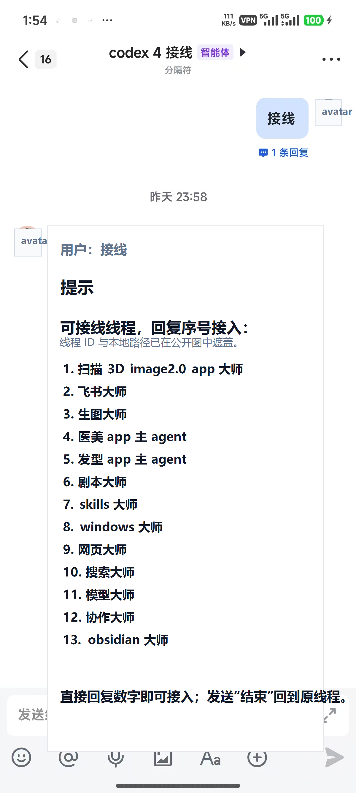
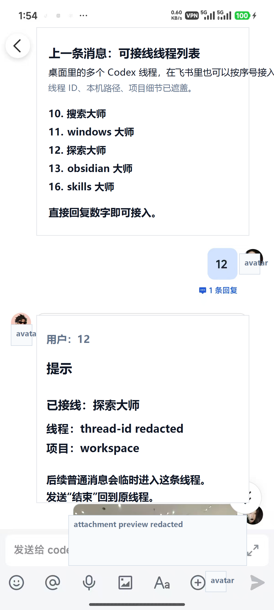

# 把飞书变成本机 Codex 的远程入口：codex-feishu-bridge Skill

我整理了一个 Codex skill：**codex-feishu-bridge**。

它不是一个云服务，也不是一个飞书机器人成品托管平台。它更像一本给 Codex 用的本地运维手册：当你想让飞书或 Lark 成为本机 Codex 的远程入口时，Codex 可以按这套 skill 去安装、排障、接多机器人、处理附件、做 Windows 守护，并在发布前守住公开和私有信息边界。

更直白一点：它的目标不是做一个“会聊天的机器人”，而是让飞书端拥有接近 Codex 桌面线程的入口能力。你可以在手机上看到可接线的本机 Codex 线程，按序号接入某一条线程，然后后续普通消息就临时进入那条线程。

## 接近桌面线程的飞书入口

桌面 Codex 里有多个长期线程：windows 大师、skills 大师、网页大师、搜索大师、项目主 agent 等。飞书桥的接线模式，就是把这些本机线程映射到飞书里。

在飞书里回复“接线”，可以看到可接线线程列表：

回复对应序号后，就能把后续消息临时送进指定线程：

这不是完全复制桌面 UI，但核心工作流很接近：同一批本机线程、同一套项目上下文、同样可以继续交代任务、传图片和文件，只是入口从桌面切到了飞书。

## 它解决什么问题

本地 Codex 飞书桥一旦开始长期使用，问题通常不在“能不能跑一次”，而在这些细节：

- 飞书事件有没有真正进到本地 runtime
- 本机 Codex app-server 是否还活着
- 多个机器人是不是共用了同一份 sessions 或 lock 文件
- 图片、文件、音频有没有被正确下载和转交
- Windows 重启后桥能不能恢复
- 公开发布时会不会把 app secret、API key、日志、本机路径带出去

这个 skill 把这些操作整理成固定边界，让 Codex 不用每次从零猜。

## 包含什么

公开版包含：

- `skills/codex-feishu-bridge/SKILL.md`：Codex 使用的核心维护规则。
- `agents/openai.yaml`：Codex skill 列表里的显示信息。
- `scripts/feishu_bridge_guard.ps1`：检查并拉起多个本地桥 runtime。
- `scripts/feishu_bridge_guard_supervisor.ps1`：守护 guard 进程。
- `scripts/install_feishu_bridge_guard.ps1`：安装 Windows 登录启动守护。
- `scripts/uninstall_feishu_bridge_guard.ps1`：卸载启动项和计划任务。
- `references/runtime-design.md`：本地拓扑和隔离原则。
- `references/release-boundary.md`：公开版和私有版边界。
- `references/sample-runtimes.json`：占位 runtime 配置。
- `docs/images/codex-feishu-bridge-skill/`：公开安全版插图，已遮盖线程 ID、本机路径、头像和附件预览。

## 适合谁

适合：

- 想用飞书或 Lark 远程使用本机 Codex 的人
- 有多个机器人入口，需要区分主机器人、接线员、路由机器人的人
- 想把本地桥做成长期运行，而不是临时脚本的人
- 想把相关经验做成可复用 Codex skill 的个人或小团队

不适合：

- 想要现成 SaaS 托管服务的人
- 不想维护本地运行环境的人
- 想把真实 app secret、session、日志直接放进公开仓库的人

## 安全边界

公开版只保留通用结构和占位配置。

这些内容不应该进入公开仓库：

- 真实飞书 App ID / Secret
- API key、token、provider 私有地址
- sessions、state 数据库、日志
- 截图、聊天导出、私有知识库内容
- 本机真实路径、用户名、运行清单
- `node_modules`、压缩包、tgz 构建产物

真实运行拓扑、机器人凭据映射、守护名单和维护记录，应放在私有仓库或本地文档里。

## GitHub

公开仓库：

https://github.com/anjelicafrancis03-prog/codex-feishu-bridge-skill

License：MIT

## 当前状态

这是一个公开可读的 skill 和脚本模板，不是完整商业产品。

它真正想复用的是一个原则：

> 飞书可以是远程入口，但真实运行状态、凭据和维护历史必须留在本机或私有仓库。
